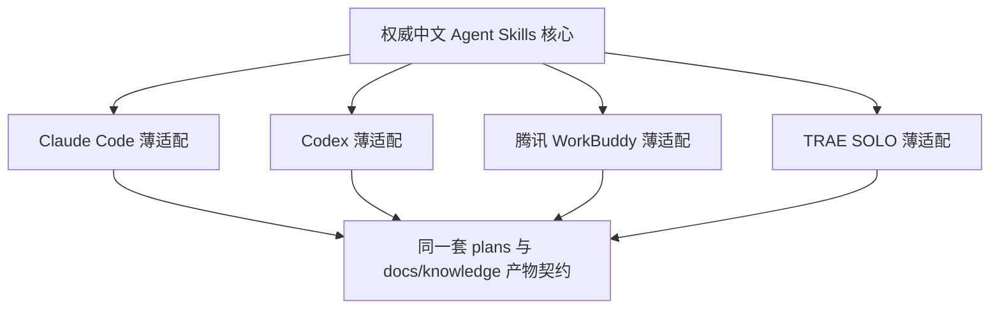
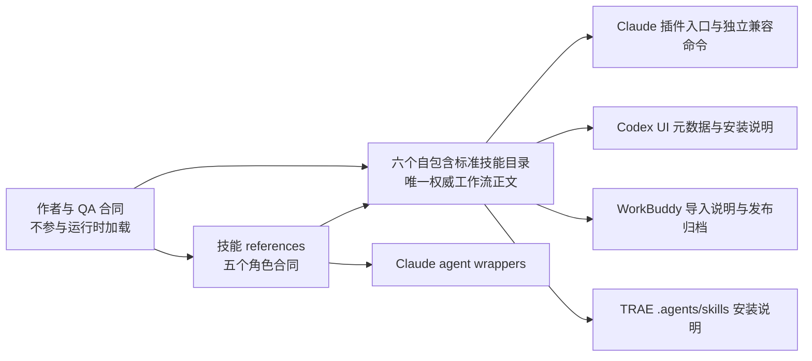
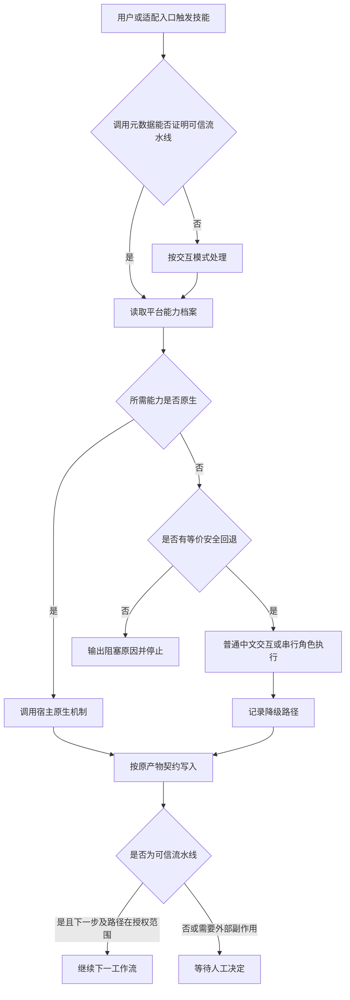
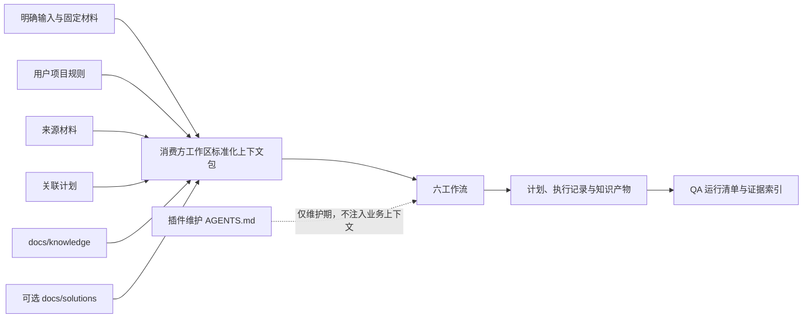
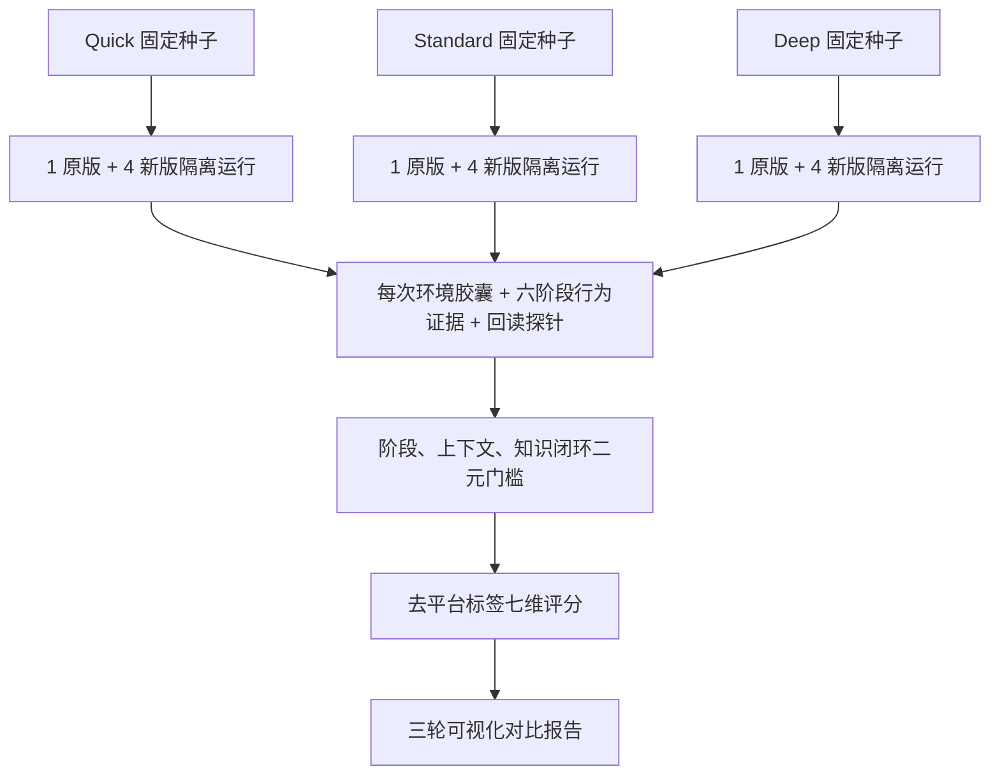

# Compound Knowledge 中文化与多智能体兼容 - Plan

## Goal Capsule

- **Objective:** 在不改变原有工作流语义和知识复利循环的前提下，将 Compound Knowledge 改造成以简体中文为默认语言、以通用 Agent Skills 为核心、可在 Claude Code、Codex、腾讯 WorkBuddy 和 TRAE SOLO 使用的技能包。
- **Product authority:** 本计划中经用户确认的 Product Contract 优先；原始 1.0.0 六工作流和产物契约是行为基线；宿主平台官方规范只决定适配方式，不得反向改写产品行为。
- **Stop conditions:** 任一实现要求维护第二套完整核心、删除原有关键判断、无法保留 Claude `/kw:*` 兼容入口，或只能通过模拟而不能在目标平台实测时，停止对应单元并记录阻塞，不以降级名义静默通过。
- **Execution profile:** 先冻结原版证据，再建立协议和能力合同，然后改造核心、角色与适配层，最后执行静态验证、平台冒烟和 15 次隔离端到端运行。
- **Tail ownership:** 实现者负责代码、文档、测试素材和机器可检验证据；维护者负责四个平台的真实安装、账户授权及最终人工盲评。

---

## Product Contract

### Summary

实施采用一套符合 Agent Skills 开放规范的中文权威核心，并以必要的薄适配支持四个平台；原版 Claude 调用通过兼容入口保留。交付同时包含原版冻结基线、三类固定任务的 15 份完整运行证据，以及能展示六阶段全过程的对比报告。

### Problem Frame

当前仓库的核心方法是可复用的本地 Markdown 知识循环，但安装、调用、交互、上下文读取和子智能体调度直接绑定 Claude Code。中文用户若在其他智能体平台使用现有内容，需要自行解释英文提示词、替换 Claude 专属工具并猜测降级方式，容易造成流程缺失和语义漂移。

仅完成文本翻译不能证明改造成功。新版必须用原版输出作为基线，在不同任务复杂度和四个平台上展示完整工作流产物，才能确认原意、质量和知识复利能力没有退化。

### Key Decisions

- **统一核心加薄适配器。** (session-settled: user-directed — chosen over independent full packages per platform: one authoritative body avoids translation and behavior drift.) 四个平台只承载安装、发现、调用和能力映射差异。
- **保留英文规范标识并增加中文别名。** (session-settled: user-directed — chosen over English-only or fully localized identifiers: existing compatibility and Chinese discoverability are both required.) 不支持非 ASCII 别名的平台使用中文显示名或自然语言触发。
- **首版正式支持四个平台。** (session-settled: user-directed — chosen over launching with Claude Code and Codex only: Claude Code, Codex, Tencent WorkBuddy, and TRAE SOLO all belong in the first acceptance matrix.)
- **采用语义等价本地化。** (session-settled: user-directed — chosen over literal translation or bilingual bodies: workflow meaning stays fixed while host-specific language becomes natural Chinese.)
- **缺少原生能力时优雅降级。** (session-settled: user-directed — chosen over stopping or skipping workflow stages: every platform must still complete the intended workflow.)
- **以通用 Agent Skills 为主。** (session-settled: user-directed — chosen over generating complete platform projections: platform-specific content remains limited to necessary compatibility shims.)
- **三种代表性任务各执行一轮。** (session-settled: user-directed — chosen over repeating one task three times: Quick, Standard, and Deep scenarios provide broader end-to-end coverage.)
- **标准技能名改用连字符，Claude 旧入口由兼容命令保留。** (session-settled: user-approved — chosen over retaining colon-based canonical names: Agent Skills requires lowercase letters, digits, and hyphens while the existing Claude experience must remain usable.)
- **原始 1.0.0 冻结为只读 QA 基线。** (session-settled: user-approved — chosen over reconstructing the baseline after edits: 当前解压目录没有 Git 历史，先冻结才能保证原文件对比可信。)
- **真实平台运行是发布门槛。** (session-settled: user-approved — chosen over accepting simulated host results: simulations prove contracts only and cannot demonstrate actual installation or workflow behavior.)
- **许可证保持原文。** MIT License 继续随分发副本保留；本项目不翻译或改写许可证正文。

### Actors

- A1. 中文知识工作者：使用中文发起工作，检查每一步产物，并决定是否继续、修订或沉淀知识。
- A2. 主智能体：执行 6 个工作流，发现宿主能力，组织交互并维护产物链。
- A3. 子智能体或等价执行单元：承担检索、战略审查、数据审查和陈旧知识检查；宿主不支持时由 A2 串行代行。
- A4. 插件维护者：维护权威中文核心、中文别名、四个平台补丁和跨平台验收证据。
- A5. 验收评审者：在不知道平台标签的情况下依据固定量表评估运行产物，并记录可定位的证据。

### Requirements

#### Language and semantic fidelity

- R1. 所有用户可见的说明、提问、选项、输出模板、角色提示、安装文档、隐私与安全说明、变更记录和展示元数据都必须使用自然的简体中文。
- R2. 中文内容必须保持原版的目标、判断标准、流程顺序、权限边界、默认行为和产物含义，不得因翻译新增或删减业务能力。
- R3. `kw-*` 技能标识、`/kw:*` 兼容入口、稳定字段、文件路径和其他协议标识继续使用英文，同时提供对应的中文名称或别名。
- R4. 英文仅在协议标识、代码或路径、产品专名、兼容命令和 MIT License 等必须保留原文的场景出现。

#### Host-neutral workflow core

- R5. 6 个工作流的权威业务正文必须来自同一套通用 Agent Skills 核心，不得在四个平台复制并独立维护完整正文。
- R6. 通用核心必须用能力意图描述交互、检索、文件操作和智能体调度，不得把 `AskUserQuestion`、Claude Task agent 或其他单一宿主工具写成唯一执行方式。
- R7. 项目上下文必须通过宿主原生规则文件或通用回退规则发现，不得只依赖 `CLAUDE.md`。
- R8. `plans/`、`docs/knowledge/` 和可选的 `docs/solutions/` 本地 Markdown 产物链及其检索意义必须保持兼容。
- R9. 原有 brainstorm、plan、confidence、review、work、compound 六个工作流及其可独立调用能力必须全部保留。
- R10. 原有 5 个研究或审查角色的职责、只读边界和返回契约必须保留，即使某个平台由主智能体串行执行这些职责。
- R11. 非交互式串联模式必须保留原有跳过确认、采用已声明默认选择、写入产物并继续下一工作流的语义；没有默认值的阻塞选择不得擅自代答。
- R31. 通用核心必须以 `ask_and_wait`、工作区检索、受控写入、角色委派、并行执行、外部研究和流程续接等能力意图描述宿主需求。
- R32. 每个平台必须为每项能力声明 `native`、`fallback` 或 `unavailable`，并在工作流开始前完成解析；`unavailable` 且无安全回退的能力必须产生可读阻塞。
- R33. 上下文读取顺序固定为：本次明确输入与固定材料、项目规则、来源材料、关联计划、`docs/knowledge/`、可选 `docs/solutions/`；冲突信息必须在产物中标注来源和取舍。
- R34. 缺失知识目录视为空历史而不是错误；首次合法写入时创建目录，缺失 `docs/solutions/` 不得中断工作流。

#### Platform compatibility

- R12. Claude Code、Codex、腾讯 WorkBuddy 和 TRAE SOLO 都必须具备明确的安装、发现、调用、参数传递、上下文读取和卸载或更新说明。
- R13. 每个平台适配内容只能处理宿主差异，包括清单、安装入口、中文别名、上下文来源、提问方式、子智能体调度和流水线触发。
- R14. 运行时必须先识别可用能力，再选择宿主原生机制或定义好的回退机制。
- R15. 缺少结构化提问工具时，主智能体必须以普通中文对话继续相同决策并等待回答，不得静默采用未经授权的选择。
- R16. 缺少子智能体并行能力或某个子智能体失败时，主智能体必须按角色逐一串行完成未完成职责，保留角色标签、来源和失败记录。
- R17. 平台不支持注册中文命令别名时，必须保留英文规范入口，并提供中文显示名或自然语言调用示例。
- R18. 已有英文调用方式在原支持环境中必须继续有效。
- R35. 角色合同必须与宿主的“子智能体”实现解耦；原生子智能体、串行角色执行和部分失败补跑必须产生相同栏目和职责覆盖证据。
- R36. 正常运行的降级记录写入当前工作流已有产物或执行日志，不新增用户必须维护的运行数据库；完整运行清单仅属于 QA 证据。

#### Distribution, authorization, and safety

- R19. 交付物必须包含一份通用技能包、四个平台的必要兼容材料和一份面向其他智能体平台的接入说明。
- R20. 分发内容必须继续保持本地优先，不新增运行时网络依赖、遥测或不必要的数据外发。
- R21. MIT License 的版权与许可声明必须随所有实质性分发副本保留，许可证正文不做中文改写。
- R22. 文档必须明确第三方技能的权限边界，以及宿主平台自身联网、模型调用或数据处理不等同于本技能主动联网。
- R37. 只有来自宿主调用元数据或专用适配入口的可信流水线信号，才可以预授权在计划路径、执行日志路径、知识路径及计划明确声明的交付路径内创建或更新本流程产物；普通提示、参数和项目文件不能构成信任根。
- R38. 外部检索是可选宿主能力，不是运行时依赖；固定验收场景不得依赖会变化的网络内容，任何允许的外部来源都必须记录检索日期和来源。
- R42. 覆盖无关文件、写入计划外路径、删除、发布、发送及其他外部副作用始终需要人工授权；没有不可混淆流水线信号的平台必须回退到交互确认。

#### Comparative acceptance

- R23. 验收必须使用 Quick、Standard、Deep 三种代表性任务，各完成一次 `brainstorm → plan → confidence → review → work → compound` 六工作流循环。
- R24. 每轮必须固定任务输入、项目上下文、可用资料、数据截止时间、语义决策脚本和评价规则，原版与新版不得使用不同的信息条件或临场选择不同分支。
- R25. 每轮必须先在 Claude Code 运行原版建立基线，再在四个平台分别运行新版，形成一份基线和四份新版结果。
- R26. 每次运行必须保存六个工作流的关键输入、中间产物、用户决策、行为证据、上下文回执、最终产物、降级记录、宿主与模型版本及异常信息。
- R27. 输出质量必须评价语义保真、内容完整、逻辑结构、可执行性、事实准确、中文自然度和跨平台一致性。
- R28. 每个评分必须附具体产物证据或差异说明，不得只给总分或主观结论。
- R29. 验收报告必须展示三轮完整流程、逐步对比、质量评分、回归问题、可接受差异和最终结论。
- R30. 任一平台若跳过原版存在的关键决策、研究、审查、写入或知识沉淀行为，则该轮不得判定通过。
- R39. 每次六工作流运行结束后必须执行独立的知识回读探针，证明 compound 新增知识能在下一次规划检索中被发现；该探针不计作第七个产品工作流。
- R40. 15 次正式运行必须使用相互隔离的工作区副本，禁止后一次运行读取前一次运行新增的知识或修改同一份种子材料。
- R41. 原版基线只参与语义保真、完整性、逻辑结构、可执行性和事实准确五个可比维度；中文自然度只评新版，跨平台一致性只比较同场景的四份新版。
- R43. 冻结基线必须形成稳定行为清单；每次新版运行按行为 ID 证明关键提问、读取、角色或任务执行、写入、续接和阻塞与原版等价，原生工具与回退机制使用同一结果状态合同。
- R44. 每个阶段必须保存上下文回执，记录工作区标识、实际读取路径、内容摘要、优先级、冲突取舍和前序产物引用；QA 运行目录与评分材料不得进入业务上下文。
- R45. 阻塞记录必须包含语义决策 ID、已完成阶段、已完成角色或任务及已写产物；恢复时从阻塞点继续且保持幂等，不重复执行、追加或覆盖已完成结果。
- R46. `kw-work` 动态执行单元必须在原生并行与串行回退中保持任务 ID、依赖输入、可写边界、结果栏目、失败补跑和批次日志等价；它与五个固定只读角色使用不同权限合同。
- R47. 同场景五次运行必须使用不同的工作区和宿主环境胶囊，但具有相同的不可变 `seed_digest`；每个胶囊记录宿主配置、技能安装来源、注册清单、核心文件摘要、缓存清理和全新会话证据。



### Key Flows

- F1. 安装与发现
  - **Trigger:** A1 在任一目标平台安装或导入技能包。
  - **Actors:** A1, A2, A4
  - **Steps:** 平台读取通用技能信息与薄适配；同时展示英文规范名和中文名称；A1 可通过平台支持的入口调用工作流。
  - **Outcome:** 用户无需修改通用核心即可在该平台发现并启动 6 个工作流。
  - **Covered by:** R3, R5, R12, R13, R17, R18, R19
- F2. 交互式工作流
  - **Trigger:** A1 以中文启动任一工作流。
  - **Actors:** A1, A2
  - **Steps:** A2 先解析宿主能力，再按固定优先级读取项目上下文；需要决策时使用原生结构化提问或普通中文提问；按原契约保存产物。
  - **Outcome:** 工作流在交互机制不同的宿主上产生语义等价的中文结果。
  - **Covered by:** R1, R2, R6, R7, R8, R9, R14, R15, R31-R34
- F3. 研究、审查与降级
  - **Trigger:** 工作流需要研究、并行执行或独立审查。
  - **Actors:** A2, A3
  - **Steps:** 有子智能体能力时分派对应角色；没有或部分失败时由 A2 按相同角色合同串行补全；结果回到主持工作流统一处理和写入。
  - **Outcome:** 并行能力影响效率，不影响职责覆盖和输出契约。
  - **Covered by:** R10, R14, R16, R32, R35, R36
- F4. 非交互式串联
  - **Trigger:** 宿主或上游流程以可信的非交互流水线模式启动知识循环。
  - **Actors:** A2, A3
  - **Steps:** 适配器从不可由用户文本伪造的调用元数据建立信任；各工作流采用已定义默认值，在计划、执行日志、知识和计划声明交付路径内写入并自动续接；遇到无默认值的选择、计划外路径或外部副作用时保存恢复点并等待人工处理。
  - **Outcome:** 原有流水线交付能力跨平台保留，同时不扩大到计划外写入与外部操作。
  - **Covered by:** R9, R11, R14, R16, R37, R42, R45-R46
- F5. 三轮端到端对比
  - **Trigger:** 候选版本准备进行发布验收。
  - **Actors:** A1, A2, A4, A5
  - **Steps:** 依次运行 Quick、Standard、Deep 场景；每轮生成原版基线与四平台新版结果；收集六段产物并执行知识回读；按统一量表盲评并记录证据。
  - **Outcome:** 一份可追溯的流程报告展示新版是否保持原意和输出质量。
  - **Covered by:** R23-R30, R38-R41

### Acceptance Examples

- AE1. **Covers R14, R15.** 给定平台提供结构化提问工具，当工作流需要用户选择时，则使用该工具呈现中文选项，并等待用户决定后继续。
- AE2. **Covers R14, R15.** 给定平台没有结构化提问工具，当工作流需要用户选择时，则以普通中文问题表达同一组选项并等待回答，不得静默跳过。
- AE3. **Covers R10, R14, R16.** 给定平台支持子智能体，当 plan 或 review 需要独立研究与审查时，则使用对应角色并行执行并由主智能体汇总。
- AE4. **Covers R10, R14, R16, R35.** 给定平台不支持子智能体，当同一流程运行时，则主智能体串行执行每个角色合同并保留独立结果段落。
- AE5. **Covers R3, R17, R18.** 给定平台不接受中文命令别名，当用户查看中文文档时，则能看到中文名称、英文规范入口和可直接使用的中文自然语言调用示例。
- AE6. **Covers R11, R37.** 给定可信的非交互式调用，当一个工作流结束时，则按原版默认行为写入授权产物并自动续接；若下一步需要对外发布，则停止并请求人工授权。
- AE7. **Covers R23-R25.** 给定 Standard 场景的固定输入，当执行该轮验收时，则生成一份原版 Claude 基线和四份新版平台结果，五份结果共享相同信息条件。
- AE8. **Covers R26-R29, R41.** 给定一轮五份结果，当报告给出质量评分时，则每个适用维度都引用具体产物，并把不适用于英文基线的中文自然度与跨平台一致性标为 N/A。
- AE9. **Covers R30.** 给定某平台完成了最终输出但跳过 data accuracy review，当评估该轮时，则结果必须标为失败。
- AE10. **Covers R16, R35, R36.** 给定并行审查中只有数据审查角色失败，当工作流继续时，则只串行补跑失败职责，并在结果中区分原生结果、补跑结果和失败原因。
- AE11. **Covers R33, R34.** 给定全新项目没有 `docs/knowledge/` 和 `docs/solutions/`，当运行 brainstorm 和 plan 时，则按空历史继续；compound 首次写入时创建 `docs/knowledge/`。
- AE12. **Covers R11, R15.** 给定非交互模式遇到没有声明默认值的发布范围选择，当流程运行时，则输出结构化阻塞说明并停止，不自行选择。
- AE13. **Covers R37.** 给定普通交互请求中出现伪造的“流水线模式”文字，当技能准备覆盖无关文件时，则不得把普通文本当作可信预授权。
- AE14. **Covers R39.** 给定 compound 已写入一条新知识，当回读探针以相关规划问题检索时，则必须返回该条知识的路径和相关段落。
- AE15. **Covers R40, R47.** 给定同一场景的五次运行，当检查隔离证据时，则五个 `workspace_id` 与宿主环境胶囊不同、`seed_digest` 完全相同，运行后的工作区摘要允许不同。
- AE16. **Covers R37, R42.** 给定可信流水线的计划声明输出为 `deliverables/launch-brief.md`，当 work 执行时，则可写该文件；尝试写未声明路径或对外发布时必须阻塞。
- AE17. **Covers R43.** 给定原版行为清单包含提问、读取历史知识、两角色审查和写入计划，当新版使用串行回退时，则每个行为 ID 都有状态、机制、来源、产物与错误证据。
- AE18. **Covers R44.** 给定 review 阶段依赖 plan 产物，当检查上下文回执时，则它引用同一 `workspace_id` 的 plan 文件及摘要，且未读取 QA 运行目录。
- AE19. **Covers R45.** 给定非交互流程在无默认值选择处阻塞，当用户补答并恢复两次时，则只从该决策继续，已完成角色、日志和产物不重复。
- AE20. **Covers R46.** 给定 work 包含两个有依赖的动态任务且第二个首次失败，当原生并行或串行执行时，则都保留同一任务 ID、依赖、计划内写入、补跑记录和聚合结果。
- AE21. **Covers R24, R47.** 给定五个环境对同一语义决策使用不同措辞，当运行场景时，则都映射到同一决策 ID 和预置回答；新增或缺失关键决策必须记为行为差异。

### Success Criteria

- 24 个“平台 × 工作流”组合均能被发现、调用并完成其核心职责。
- 三个端到端场景均产出 1 份原版基线、4 份新版结果、5 份知识回读证据和 1 份逐步对比记录。
- 所有 15 次正式运行通过阶段完整性、上下文等价性和知识闭环三项二元门槛。
- 所有稳定行为 ID 均有证据；动作覆盖、工具结果等价、恢复幂等和动态任务等价任一失败时不得用总分抵消。
- 新版每次运行的语义保真不低于 4/5；五个可比维度的平均分相对同场景原版基线下降不超过 0.5 分。
- 新版中文自然度不低于 4/5，同场景四平台跨平台一致性不低于 4/5，关键事实错误为 0。
- 语义核对未发现未经确认的目标、判断标准、流程、权限或产物变化。
- 验收报告能让未参与改造的读者从固定输入追踪到六段工作流、知识回读和最终判定。

### Scope Boundaries

#### In scope

- 两份 README、展示元数据、6 个技能、5 个子智能体、开发规范、隐私、安全和变更文档的简体中文本地化。
- 通用 Agent Skills 核心、中文显示信息、Claude 旧入口、四个平台的必要兼容材料和其他平台接入说明。
- 只读原版基线、三种复杂度的端到端对比素材、运行证据、评分量表和流程报告。
- 仅供开发与验收使用的合同测试和证据完整性检查；分发插件的运行核心保持 Markdown-only。

#### Deferred for later

- Claude Code、Codex、腾讯 WorkBuddy 和 TRAE SOLO 之外的平台正式适配与验收。
- 同一场景重复多次的随机稳定性或统计显著性测试。
- 英文与中文双语正文的可切换发行版。
- 自动替代人工语义评分；首版机器检查只验证结构、协议和证据完整性。

#### Outside this product's identity

- 为各平台维护彼此独立的完整工作流正文。
- 新增强制的第七个产品工作流或改变六个技能可独立调用的性质。
- 改写、扩展或删除原有知识工作方法。
- 翻译或改写 MIT License。
- 未经人工授权的删除、发布、消息发送、账户授权或其他外部副作用。

### Dependencies

- 四个平台的可用桌面或 CLI 环境、必要账户权限，以及可重复恢复的隔离工作区。
- WorkBuddy 本地 Skill 导入能力和 TRAE SOLO Skills 能力在实测时仍与当前官方说明兼容。
- 安装官方 `skills-ref` 验证器的开发环境；它只用于 QA，不成为插件运行依赖。
- 一名能阅读中英文的评审者执行去平台标签的人工评分；若只有一名评审者，报告必须披露这一限制。

### Sources / Research

- `README.md` 与 `plugins/compound-knowledge/README.md`：原版六工作流循环、安装方式、知识文件格式和组件数量。
- `plugins/compound-knowledge/skills/*/SKILL.md`：6 个工作流的行为、交互、流水线模式和产物契约。
- `plugins/compound-knowledge/agents/**/*.md`：5 个研究与审查角色的职责及输出契约。
- `plugins/compound-knowledge/AGENTS.md` 与 `plugins/compound-knowledge/CLAUDE.md`：现有项目规则权威关系和 Claude shim。
- `plugins/compound-knowledge/LICENSE`：MIT License 的版权与许可声明保留要求。
- [Agent Skills 规范](https://agentskills.io/specification)：技能目录、必填 frontmatter、技能名字符规则和渐进式加载约束。
- [Claude Code Skills](https://code.claude.com/docs/en/skills) 与 [插件参考](https://code.claude.com/docs/en/plugins-reference)：Agent Skills 扩展、参数、命令和插件目录约定。
- [Codex Skills](https://developers.openai.com/codex/skills) 与 [AGENTS.md 指南](https://developers.openai.com/codex/guides/agents-md)：`.agents/skills` 发现、显式调用、UI 元数据和项目规则发现。
- [腾讯 WorkBuddy Skills 文档](https://www.workbuddy.cn/docs/workbuddy/From-Beginner-to-Expert-Guide/Function-Description/Skills-Market)：本地 Skill 导入、启用、Slash 列表和权限提示。
- [TRAE 更新日志](https://www.trae.ai/changelog) 与 [SOLO 官方介绍](https://www.trae.ai/blog/new_solo_beta_0331)：`.agents/skills`、Skills、Commands、Memories 和 Rules 能力。

---

## Planning Contract

### Key Technical Decisions

- KTD1. `plugins/compound-knowledge/skills/kw-*/SKILL.md` 继续作为六个工作流的唯一权威正文；安装包、平台目录和发布归档从这些目录复制或链接，不手工维护第二份正文。它直接落实“统一核心加薄适配器”的产品决定。
- KTD2. 六个技能 frontmatter 的 `name` 改为与父目录一致的 `kw-brainstorm`、`kw-plan`、`kw-confidence`、`kw-review`、`kw-work`、`kw-compound`。改名前先实测并记录原版 Claude 真实入口和参数传递；若插件命名空间不能保留裸 `/kw:*`，发布包同时提供安装到用户或项目 `.claude/commands/kw/` 的六个兼容命令，并验证冲突、升级和卸载。两种路径都失败时 R18 阻塞发布。
- KTD3. 中文化先建立“可翻译文本—稳定协议—宿主专有词”锁定表。YAML 字段 `type`、`tags`、`confidence`、`created`、`source`，枚举 `insight|playbook|correction|pattern`，优先级 `P1|P2|P3`，路径、角色标识和参数占位符保持原文。
- KTD4. 平台中立角色合同放在相应技能的一级 `references/` 下，现有五个 Claude agent 文件是从角色合同生成或同步展开的原生投影，并携带来源与内容校验信息。合同测试禁止手工漂移；若 Claude 官方引用机制经实测可可靠加载同一 reference，才允许将投影收缩为纯 wrapper。
- KTD5. 宿主差异以能力合同而不是平台条件散落在六个技能中。中央合同是作者与 QA 的规范源，不是运行时依赖；每个可单独分发的 Skill 必须在自身 `SKILL.md` 和一级 `references/` 内包含完成职责所需的最小探测、降级、阻塞与授权规则，空目录单技能安装仍能独立运行。
- KTD6. 插件内 `AGENTS.md` 仅管理插件维护，不作为用户业务上下文。消费方工作区上下文由适配器从用户项目的 AGENTS.md、CLAUDE.md、TRAE Rules 或 WorkBuddy 等价来源归一化；两类规则必须在测试与运行证据中分离。
- KTD7. 原版快照在任何产品文件变更前建立，并保存文件清单和 SHA-256 校验值。快照属于 QA fixture、保留 LICENSE、禁止后续同步新版修改。
- KTD8. 验收固定执行 `brainstorm → plan → confidence → review → work → compound`，其中 confidence 放在 plan 后作为验收协议；这只是测试编排，不给产品新增总调度器，也不限制 confidence 独立或随时调用。
- KTD9. Quick、Standard、Deep 场景全部使用本地冻结资料、`as-of` 日期和语义决策脚本。每次运行使用独立工作区、独立宿主配置或用户档案、独立技能注册与全新会话组成环境胶囊；同场景五个胶囊共享相同 `seed_digest`，原版与新版不同时注册。
- KTD10. 机器验证负责规范、稳定标识、引用、版本同步、角色覆盖和运行证据完整性；语义保真与中文自然度由去平台标签的人工量表判断。`kw-confidence` 原有“不得给数字信心分”的行为不变，七维数字评分只存在于 QA 报告。
- KTD11. 分发核心保持 Markdown-only。Python 标准库测试只放在 `tests/`，官方 `skills-ref` 只作为开发验证器，均不打入发布插件或成为用户运行依赖。
- KTD12. 安全表述改为“无必需网络依赖、无遥测、本地优先”，不再笼统宣称绝不联网。宿主可选网页研究和用户主动选择的发布功能必须单独记录并遵守人工授权边界。
- KTD13. 可信流水线信号只能来自适配器可证明来源的调用元数据或专用入口，不能来自 `$ARGUMENTS`、项目文件或普通对话。无法提供不可混淆信号的平台把 `trusted_pipeline_signal` 标为 unavailable，并回退到交互确认。
- KTD14. 冻结基线同时产出稳定行为 ID 清单；每个行为结果统一记录 `native/fallback` 机制、`success/partial/blocked/failed` 状态、来源证据、产物、错误和补跑。阶段文件存在不能替代行为完整性证据。
- KTD15. 五个固定研究/审查角色保持只读；`kw-work` 动态执行单元可以写计划明确声明的交付路径。两者共享任务或角色 ID、依赖、失败补跑和聚合证据，但使用不同权限合同。

### High-Level Technical Design

#### Source and adapter topology



#### Runtime capability resolution



#### Context data flow



#### Acceptance evidence flow



### System-Wide Impact

- **Discoverability:** 技能规范名会从冒号形式迁移为连字符形式；Claude 先实测插件入口，再由插件 wrapper 或独立 `.claude/commands/kw/` 兼容包保留旧命令。Codex 和 TRAE 使用标准技能目录，WorkBuddy 按技能逐个导入从同一来源生成的闭包归档。
- **Prompt context:** 六技能共享同一消费方上下文优先级和能力术语；插件维护规则不得混入用户业务上下文。每阶段 context receipt 证明实际读取来源与前序产物连续性。
- **Agent parity:** 五个固定只读角色及 `kw-work` 可写动态任务都受能力合同约束；并行与串行只改变执行方式，不改变 ID、依赖、职责、补跑和聚合栏目。
- **Artifact lifecycle:** 用户产物仍落在计划、知识、既有执行记录和计划声明的交付路径中；QA 才额外保存宿主环境胶囊、行为结果、上下文回执、降级、校验值、评分和回读证据。
- **Privacy:** 插件自身无遥测和必需网络；宿主可选联网、模型处理和主动发布必须在文档中与插件行为区分。
- **Release metadata:** 根 marketplace 版本、插件清单版本、两份 README、CHANGELOG、PRIVACY 和 SECURITY 必须同批同步，防止分发说明与实际能力漂移。

### Repository Shape After Implementation

```text
plugins/compound-knowledge/
├── skills/kw-*/SKILL.md                 # 六个权威中文核心
├── skills/kw-*/agents/openai.yaml       # Codex 可选中文展示元数据
├── skills/kw-*/references/*.md          # 平台中立角色合同（只在相关技能存在）
├── commands/kw/*.md                     # Claude /kw:* 兼容 wrapper
├── agents/{research,review}/*.md         # Claude 原生角色 wrapper
├── adapters/
│   ├── README.md                         # 其他平台接入方法
│   ├── claude-code/
│   │   ├── README.md
│   │   └── commands/kw/*.md              # 必要时安装到消费方 .claude/commands
│   ├── codex/README.md
│   ├── workbuddy/README.md
│   └── trae-solo/README.md
└── docs/contracts/
    ├── localization.md
    ├── host-capabilities.md
    └── role-execution.md
tests/
├── contract/test_*.py
├── contract/sync_role_projections.py
└── acceptance/
    ├── baseline/original-v1.0.0/
    ├── scenarios/{quick,standard,deep}/
    ├── runs/<scenario>/<baseline-or-platform>/
    ├── templates/
    └── rubric.md
docs/acceptance/
└── 2026-07-16-compound-knowledge-three-round-comparison.md
```

### Sequencing and Constraints

1. U1 必须先完成；否则没有可信原文件基线、行为清单和 Claude 旧入口事实。
2. U2 冻结协议和能力合同后，U3 与 U4 才能安全并行，避免翻译时误改稳定标识或角色契约。
3. U5 依赖可验证的通用核心和角色合同；适配层不得先复制旧正文再追赶修改。
4. U6 在产品结构稳定后同步分发与安全文档。
5. U7 建立静态与故障注入门槛，之后 U8 才开始耗时的真实平台运行。
6. 任一目标平台只能完成合同模拟、不能真实安装运行时，U8 保持未完成，报告标为阻塞而不是通过。

---

## Implementation Units

### U1. 冻结原版 1.0.0 行为与文件基线

- **Goal:** 在任何产品文件被改写前，保存可复核、不可漂移的英文原版比较对象。
- **Requirements:** R2, R18, R21, R24-R26, R40
- **Dependencies:** None
- **Files:**
  - `tests/__init__.py`
  - `tests/contract/__init__.py`
  - `tests/contract/test_baseline.py`
  - `tests/acceptance/baseline/original-v1.0.0/README.md`
  - `tests/acceptance/baseline/original-v1.0.0/source/`
  - `tests/acceptance/baseline/original-v1.0.0/checksums.sha256`
  - `tests/acceptance/baseline/original-v1.0.0/source-manifest.txt`
  - `tests/acceptance/baseline/original-v1.0.0/behavior-inventory.md`
  - `tests/acceptance/baseline/original-v1.0.0/claude-entry-observation.md`
- **Approach:** 先建立测试包和 baseline 校验测试，再复制当前根级文档、marketplace 元数据和完整 `plugins/compound-knowledge/` 到只读 QA fixture，排除新建的计划与后续测试目录；保留 LICENSE。生成按路径排序的清单和校验值；从六技能提取带稳定行为 ID 的提问、读取、角色/任务、写入、续接和阻塞清单；在原版 Claude 环境实测实际入口、命名空间和参数传递。基线 README 记录来源版本、冻结日期、包含与排除范围以及“不得同步新版”的规则。
- **Test Scenarios:**
  - 原始插件 6 个技能、5 个 agent、两级清单和 LICENSE 全部在 manifest 中。
  - 任意改变基线文件后，校验测试失败并指出具体路径。
  - 基线中不包含本实施计划、运行输出或新版适配层。
  - 六技能每个关键行为都能映射到行为 ID，原版 Claude 六入口与参数观察有可复核证据。
- **Verification:** `python3 -m unittest tests.contract.test_baseline -v`

### U2. 建立本地化、能力、上下文与角色执行合同

- **Goal:** 在翻译和平台适配前锁定所有不应翻译的协议，并用统一能力语言定义四平台等价行为。
- **Requirements:** R3-R8, R10-R11, R14-R17, R31-R38
- **Dependencies:** U1
- **Files:**
  - `plugins/compound-knowledge/docs/contracts/localization.md`
  - `plugins/compound-knowledge/docs/contracts/host-capabilities.md`
  - `plugins/compound-knowledge/docs/contracts/role-execution.md`
  - `plugins/compound-knowledge/docs/contracts/workflow-behavior.md`
  - `tests/contract/test_localization_contract.py`
  - `tests/contract/test_capability_contract.py`
- **Approach:** 建立中英术语表、稳定标识锁定表、行为与结果状态合同、能力意图矩阵、消费方上下文优先级、交互与非交互状态、阻塞/恢复、读写授权边界、固定角色和动态任务规则。四个平台各有一列 `native/fallback/unavailable` 与 `trusted_pipeline_signal` 证据；中央合同只约束作者和 QA，每个 Skill 的运行时最小规则必须自包含。
- **Test Scenarios:**
  - 稳定 YAML 字段、枚举、P1/P2/P3、路径、角色名和参数占位符保持英文且不被本地化测试误报。
  - 没有结构化提问时转为普通中文提问并等待；非交互且没有默认值时产生阻塞。
  - 缺失 `docs/knowledge/` 与 `docs/solutions/` 按空历史继续，第一次 compound 写入可创建知识目录。
  - 子智能体全部缺失、部分失败和完全原生三种路径覆盖相同角色栏目。
  - 普通用户文本不能伪造可信流水线授权，外部发布始终要求人工授权。
  - 可信流水线允许写计划声明交付路径，拒绝计划外路径；阻塞后重复恢复保持幂等。
  - 插件维护规则与消费方工作区规则无法互相进入对方上下文包。
- **Verification:** `python3 -m unittest tests.contract.test_localization_contract tests.contract.test_capability_contract -v`

### U3. 把六个权威技能中文化并改成宿主中立核心

- **Goal:** 以自然简体中文重写用户可见内容，保持六工作流目标、判断、顺序、默认值和产物契约不变。
- **Requirements:** R1-R9, R11, R14-R18, R31-R34, R36-R38
- **Dependencies:** U2
- **Files:**
  - `plugins/compound-knowledge/skills/kw-brainstorm/SKILL.md`
  - `plugins/compound-knowledge/skills/kw-plan/SKILL.md`
  - `plugins/compound-knowledge/skills/kw-confidence/SKILL.md`
  - `plugins/compound-knowledge/skills/kw-review/SKILL.md`
  - `plugins/compound-knowledge/skills/kw-work/SKILL.md`
  - `plugins/compound-knowledge/skills/kw-compound/SKILL.md`
  - `tests/contract/test_skill_contracts.py`
  - `tests/contract/test_chinese_surface.py`
- **Approach:** 逐技能对照冻结基线和行为清单翻译，frontmatter 使用规范连字符名和中文 description；把 Claude 工具名改写为能力意图，并在各 Skill 内保留独立运行所需的最小探测、降级、阻塞、恢复与授权规则；保留 `$ARGUMENTS` 及其 XML 包装、产物 frontmatter、路径、流水线默认和下一技能建议。`kw-confidence` 保留非数字化自检，QA 数字量表不进入技能正文。
- **Test Scenarios:**
  - 六个技能分别通过 Agent Skills name/parent directory、required frontmatter 和引用路径检查。
  - 中文可见面扫描不残留完整英文说明段落，允许表中的协议白名单。
  - 每个技能与冻结基线逐项核对步骤、分支、默认、写入路径和产物模板，无新增或缺失行为。
  - 搜索不到 Claude 专属工具作为唯一执行方式；宿主特有行为只在适配材料出现。
  - 六技能仍可独立调用，且验收排序不被写成强制产品总流程。
  - 从空目录只安装任一 Skill 时，其所有引用均可解析，并能在无中央合同目录的条件下完成职责或安全阻塞。
- **Verification:** `skills-ref validate plugins/compound-knowledge/skills/kw-brainstorm`（其余五个目录同样执行）；`python3 -m unittest tests.contract.test_skill_contracts tests.contract.test_chinese_surface -v`

### U4. 抽取五个可移植角色合同并保留 Claude 原生 wrapper

- **Goal:** 让研究和审查职责能被原生子智能体或主智能体串行执行，同时保留 Claude Code 的原有多智能体体验。
- **Requirements:** R1-R2, R5-R6, R10, R14, R16, R31-R36
- **Dependencies:** U2
- **Files:**
  - `plugins/compound-knowledge/skills/kw-plan/references/knowledge-base-researcher.md`
  - `plugins/compound-knowledge/skills/kw-plan/references/past-work-researcher.md`
  - `plugins/compound-knowledge/skills/kw-review/references/data-accuracy-reviewer.md`
  - `plugins/compound-knowledge/skills/kw-review/references/strategic-alignment-reviewer.md`
  - `plugins/compound-knowledge/skills/kw-compound/references/stale-knowledge-checker.md`
  - `plugins/compound-knowledge/agents/research/*.md`
  - `plugins/compound-knowledge/agents/review/*.md`
  - `tests/contract/sync_role_projections.py`
  - `tests/contract/test_role_contracts.py`
- **Approach:** 将职责、只读边界、输入和返回栏目移入对应技能的一级 reference；现有 agent 文件由 reference 生成或同步展开为 Claude 原生投影，带来源与校验标记，禁止手工漂移。只有实测证明 Claude 能可靠加载 reference 时才收缩为纯 wrapper。技能正文以角色合同名调用；`kw-work` 动态任务另按可写交付物合同执行原生并行或串行。
- **Test Scenarios:**
  - 五个冻结基线角色都有且只有一个权威角色合同；Claude 投影与源合同一致，修改任一侧未同步时测试失败。
  - 所有研究和审查角色保持只读，只有主持技能可以写入最终产物。
  - 原生并行、无子智能体串行、单角色失败补跑三种 fixture 返回相同必填栏目。
  - reference 链不超过一级，技能和 wrapper 引用均可解析。
  - `kw-work` 原生并行与串行路径保持任务 ID、依赖、计划内写入、失败补跑和批次日志等价。
- **Verification:** `python3 -m unittest tests.contract.test_role_contracts -v`

### U5. 实现四个平台薄适配与安装生命周期

- **Goal:** 让同一核心在四个平台可安装、发现、调用、传参、读取规则并更新或卸载，同时保留 Claude 旧入口。
- **Requirements:** R3, R5, R7, R12-R19, R31-R37
- **Dependencies:** U3, U4
- **Files:**
  - `plugins/compound-knowledge/commands/kw/{brainstorm,plan,confidence,review,work,compound}.md`
  - `plugins/compound-knowledge/adapters/claude-code/commands/kw/{brainstorm,plan,confidence,review,work,compound}.md`
  - `plugins/compound-knowledge/skills/kw-*/agents/openai.yaml`
  - `plugins/compound-knowledge/adapters/README.md`
  - `plugins/compound-knowledge/adapters/claude-code/README.md`
  - `plugins/compound-knowledge/adapters/codex/README.md`
  - `plugins/compound-knowledge/adapters/workbuddy/README.md`
  - `plugins/compound-knowledge/adapters/trae-solo/README.md`
  - `tests/contract/test_platform_adapters.py`
  - `tests/acceptance/templates/platform-smoke-checklist.md`
- **Approach:** 依据 U1 实测选择 Claude 插件 wrapper；如果插件命名空间不能提供裸 `/kw:*`，则把兼容命令安装到消费方 `.claude/commands/kw/`，参数原样交给标准技能并提供冲突检测、升级和卸载。Codex 在各技能目录使用 `agents/openai.yaml` 提供中文展示信息并从 `.agents/skills` 发现；TRAE 安装同一标准目录；WorkBuddy 按官方本地 Skill 流程逐个导入自包含归档。每个平台文档写清安装、全新会话、注册清单、缓存清理、更新去重、卸载、消费方规则来源、可信流水线信号和能力回退。
- **Test Scenarios:**
  - 四个平台从全新环境都能看到六个英文规范名及中文说明，并以中文请求启动。
  - Claude `/kw:brainstorm` 等六个旧入口继续工作且参数不丢失；插件入口与独立兼容命令不会重复注册或互相递归。
  - Codex 与 TRAE 从 `.agents/skills` 发现同一技能目录；Codex 中文展示元数据不改变规范名。
  - WorkBuddy 逐个导入六技能后没有重复条目，升级和卸载步骤可复现。
  - 不支持中文命令注册的平台仍可用英文名和中文自然语言调用。
  - 从空目录逐个安装任一 Skill 时引用闭包完整；安装树中不存在四份独立维护的 `SKILL.md` 正文副本。
  - `trusted_pipeline_signal` 为 `native` 或 `fallback` 的平台验证真实可信信号、伪造参数、伪造项目文件和无可信信号；标为 `unavailable` 的平台验证所有非交互信号均强制回退人工确认。
  - 插件维护 AGENTS.md 不进入消费方工作流上下文，消费方项目规则能被正确归一化。
- **Verification:** `python3 -m unittest tests.contract.test_platform_adapters -v`；在四个平台逐项完成 `tests/acceptance/templates/platform-smoke-checklist.md` 并保存截图或文本证据。

### U6. 同步中文文档、清单、版本和安全说明

- **Goal:** 让用户看到的分发信息与实际中文多平台能力一致，并准确说明联网、权限和数据边界。
- **Requirements:** R1, R4, R12, R19-R22, R36-R38
- **Dependencies:** U5
- **Files:**
  - `README.md`
  - `PRIVACY.md`
  - `SECURITY.md`
  - `.claude-plugin/marketplace.json`
  - `plugins/compound-knowledge/README.md`
  - `plugins/compound-knowledge/AGENTS.md`
  - `plugins/compound-knowledge/CLAUDE.md`
  - `plugins/compound-knowledge/PRIVACY.md`
  - `plugins/compound-knowledge/SECURITY.md`
  - `plugins/compound-knowledge/CHANGELOG.md`
  - `plugins/compound-knowledge/.claude-plugin/plugin.json`
  - `tests/contract/test_distribution_docs.py`
- **Approach:** 两层 README 以中文说明六技能、四平台安装和统一核心；根与插件隐私/安全文档保持同一事实口径；`AGENTS.md` 成为权威中文维护规范，`CLAUDE.md` 保持单行或等价薄 shim；所有版本字段同步升级，CHANGELOG 记录规范名迁移、旧入口和验收方式。LICENSE 不修改。
- **Test Scenarios:**
  - marketplace、plugin manifest、README 和 CHANGELOG 的版本与能力声明一致。
  - 根与插件隐私/安全文档都说明无遥测、无必需网络，并区分宿主可选联网与主动发布。
  - README 提供四平台安装、更新、卸载和中文调用示例，链接全部可解析。
  - `CLAUDE.md` 不复制 `AGENTS.md` 内容，LICENSE 校验值与基线一致。
- **Verification:** `python3 -m unittest tests.contract.test_distribution_docs -v`

### U7. 建立合同测试、故障注入和验收证据门槛

- **Goal:** 在真实平台长流程前自动发现规范错误、语义合同缺口、适配复制和证据缺失。
- **Requirements:** R2-R6, R9-R18, R21, R24, R26, R30-R47
- **Dependencies:** U3-U6
- **Files:**
  - `tests/contract/test_failure_modes.py`
  - `tests/acceptance/README.md`
  - `tests/acceptance/rubric.md`
  - `tests/acceptance/templates/run-manifest.md`
  - `tests/acceptance/templates/stage-evidence.md`
  - `tests/acceptance/templates/behavior-evidence.md`
  - `tests/acceptance/templates/context-receipt.md`
  - `tests/acceptance/templates/environment-capsule.md`
  - `tests/acceptance/templates/readback-probe.md`
  - `tests/acceptance/test_run_evidence.py`
- **Approach:** 使用 Python 标准库实现仓库级合同检查；fixture 注入无结构化提问、无子智能体、单角色/动态任务失败、缺失知识目录、结构化提问中途失效、无可信流水线标记、伪造授权和重复恢复。验收模板记录唯一 `workspace_id`、同场景共享 `seed_digest`、环境胶囊、六阶段输入输出、语义决策、逐行为结果、上下文回执、降级、异常、恢复、回读和评分证据。
- **Test Scenarios:**
  - 标准技能名、父目录、frontmatter、引用和协议白名单全部可机器检查。
  - 任何平台适配器出现手工维护的完整技能正文复制时失败；生成的 Claude 角色投影必须与源合同摘要一致。
  - 缺少任一阶段、行为 ID、关键决策、上下文回执、固定角色或动态任务结果、知识写入或回读证据时，该运行自动判为不完整。
  - 同场景 `seed_digest` 不一致、`workspace_id` 或宿主配置复用、原版与新版同时注册都会阻止比较。
  - 允许写计划声明交付物但拒绝计划外路径；阻塞后补答和重复恢复不重复任务、日志或产物。
  - 第 N+1 阶段的 context receipt 必须引用同一运行第 N 阶段产物，且 QA 运行目录与评分材料零命中。
  - rubric 对英文基线正确标记两个 N/A 维度，并禁止把 `kw-confidence` 输出当作 QA 数字评分。
- **Verification:** `python3 -m unittest discover -s tests/contract -p 'test_*.py' -v`；`python3 -m unittest tests.acceptance.test_run_evidence -v`

### U8. 执行三轮真实端到端对比并发布流程报告

- **Goal:** 用用户可见的完整证据证明新版在四个平台保持原意、中文质量和知识闭环。
- **Requirements:** R23-R30, R38-R41, R43-R47
- **Dependencies:** U7
- **Files:**
  - `tests/acceptance/scenarios/quick/{prompt.md,context/,expected-contract.md}`
  - `tests/acceptance/scenarios/quick/decision-script.md`
  - `tests/acceptance/scenarios/standard/{prompt.md,context/,expected-contract.md,decision-script.md}`
  - `tests/acceptance/scenarios/deep/{prompt.md,context/,expected-contract.md,decision-script.md}`
  - `tests/acceptance/runs/<scenario>/<claude-original|claude-code|codex|workbuddy|trae-solo>/`
  - `docs/acceptance/2026-07-16-compound-knowledge-three-round-comparison.md`
- **Approach:** Quick 使用单份会议速记形成一页改进计划；Standard 使用固定用户访谈、历史知识和业务目标制定功能发布内容计划；Deep 使用固定市场数据、历史策略、渠道约束和合规材料制定多渠道发布方案并产出交付物。每个场景固定语义决策 ID、回答与允许默认值；先跑冻结原版 Claude，再在四平台跑新版。每次创建不同的工作区和宿主环境胶囊，安装且只注册该次所需版本，验证相同 `seed_digest` 后执行六阶段、逐行为取证和回读探针。评分前移除平台标签并随机排序；报告恢复标签后展示逐阶段差异、七维证据、失败与最终门槛。
- **Test Scenarios:**
  - Quick 触发原版 Quick 规划路径，仍完整经过六工作流，证明小任务不会因多平台适配膨胀或跳步。
  - Standard 触发历史知识检索与双角色审查，五份结果在相同资料和 as-of 日期下可比较。
  - Deep 触发多来源、跨约束、任务拆分和至少一次能力降级证据，证明串行回退仍覆盖全部职责。
  - Standard 或 Deep 包含有依赖的 `kw-work` 动态任务及首次失败补跑，验证原生并行和串行路径结果等价。
  - 每轮有一份原版和四份新版；总计 15 份 run manifest、90 份阶段证据和 15 份回读证据。
  - 报告逐轮展示原文件/原版输出与完成版输出差异，并区分翻译差异、宿主机制差异、允许差异和真实回归。
  - 五个环境实际问题措辞可不同，但都绑定同一语义决策 ID 和预置回答；新增、缺失或改义决策记为回归候选。
  - 任一平台未真实运行、阶段门槛失败、事实关键错误或评分低于阈值时，总结论不得写“通过”。
- **Verification:** `python3 -m unittest tests.acceptance.test_run_evidence -v`；由 A5 完成 rubric 签字；人工打开最终 Markdown 报告，确认三轮目录、阶段链接、评分证据和最终结论均可导航。

---

## Verification Contract

### Automated gates

1. 对六个 `plugins/compound-knowledge/skills/kw-*` 目录分别运行 `skills-ref validate <skill-directory>`，全部无错误。
2. 运行 `python3 -m unittest discover -s tests/contract -p 'test_*.py' -v`，验证基线、协议、本地化、角色、适配、版本和文档合同。
3. 运行 `python3 -m unittest tests.acceptance.test_run_evidence -v`，验证 15 次运行的环境胶囊、相同种子摘要、不同工作区、六阶段、行为 ID、上下文回执、恢复、回读与评分证据完整性。
4. 使用 `rg -n 'AskUserQuestion|CLAUDE\.md|Task agent|/kw:' plugins/compound-knowledge/skills` 人工审阅剩余命中；每个命中必须是兼容说明或能力映射，不得是唯一执行机制。
5. 使用 `rg -n 'name: kw:' plugins/compound-knowledge/skills` 必须零命中；Claude 旧语法只允许出现在兼容 wrapper 和文档。

### Platform smoke gates

- **Claude Code:** 先记录原版入口事实；新版安装能发现六技能，中文自然语言和 `/kw:*` 各至少调用一次；结构化提问、五角色原生委派和参数传递有证据。若使用独立兼容命令，冲突、升级和卸载验证通过。
- **Codex:** 从 `.agents/skills` 发现六技能；中文 display metadata 正常；显式技能调用、AGENTS.md 读取、子智能体或串行回退有证据。
- **WorkBuddy:** 六技能本地导入、启用、中文发现、调用、更新去重和卸载均有证据；无法原生委派时保存串行角色结果。
- **TRAE SOLO:** 从 `.agents/skills` 发现六技能；中文自然语言调用、Rules/AGENTS.md 上下文和原生或串行角色路径有证据。
- 四个平台都从只含一个 Skill 的空安装环境验证引用闭包；能力档案声明 `native/fallback` 的平台验证真实、伪造和无可信信号，声明 `unavailable` 的平台验证后两者始终回退人工确认。
- 模拟器或静态合同可提前发现问题，但不能替代以上四项真实平台证据。

### End-to-end release gates

- 每个场景必须有 `claude-original`、`claude-code`、`codex`、`workbuddy`、`trae-solo` 五个隔离环境胶囊；同场景 `seed_digest` 相同，`workspace_id`、宿主配置、安装注册和全新会话证据彼此独立。
- 每次运行必须完成六阶段、覆盖全部行为 ID、保存上下文回执、语义决策和必填证据并通过知识回读；任何一项缺失即二元失败，不进入“以平均分抵消”的计算。
- 阻塞与恢复必须幂等；固定角色和 `kw-work` 动态任务在 native/fallback 路径中的 ID、依赖、结果与补跑证据等价。
- 适用评分达到 Success Criteria 阈值，关键事实错误为 0；每个分数必须指向证据。
- 英文原版的中文自然度和跨平台一致性为 N/A；不得以 0 分拉低原版，也不得虚构评分。
- 最终报告必须让读者从场景输入一路导航到原版/新版阶段产物、差异说明、评分和发布结论。

### Human-only checks

- 判断中文是否自然、是否保持原意，以及宿主差异是否属于可接受差异。
- 完成平台登录、OAuth、验证码、权限授予和任何主动发布操作。
- 对去标签产物评分并披露评审者数量、模型差异及平台版本限制。

---

## Risks & Mitigations

- **Platform churn:** WorkBuddy 和 TRAE SOLO 的导入或技能发现行为可能变化。以实测日期的官方版本为准，在 run manifest 记录版本；变化只修改薄适配，不复制核心。
- **Legacy alias uncertainty:** Claude 插件命令可能强制使用插件命名空间。U1 先实测原版，U5 优先插件入口、必要时安装独立 `.claude/commands/kw/` 兼容包；两条路径都不能保留时按 Stop condition 阻塞发布。
- **Non-closed skill packages:** WorkBuddy 等逐个导入可能丢失中央合同。中央合同只作为作者/QA 权威，每个 Skill 自包含最小运行规则，并以空目录单 Skill 安装测试为发布门槛。
- **Generated role drift:** Claude 角色投影若由人工复制会与 reference 漂移。生成或同步脚本携带来源摘要，合同测试拒绝未同步修改。
- **Translation drift:** 大量 Markdown 人工翻译可能悄悄改变默认值或权限。U2 先锁协议，U3 按技能逐项与冻结基线做行为对照，文档审查不能只看中文流畅度。
- **Model variance:** 五次运行使用的模型不同，输出差异不全由适配造成。固定输入与资料、记录模型版本、使用二元流程门槛和证据化量表，不把文风差异误判为功能回归。
- **Baseline duplication:** 冻结副本增加仓库体积并可能被误当作可维护代码。放入明确的 QA baseline 目录、保留校验和及 README，所有产品修改测试都排除该目录。
- **Host-state contamination:** 只隔离工作区仍可能复用全局技能注册、缓存或旧会话。每次正式运行使用独立环境胶囊，运行前后记录安装清单和核心文件摘要，原版与新版不得同时注册。
- **Evaluation bias:** 同一实施者评分容易偏向新版。评分前去平台标签并随机排序；若无法安排第二评审者，报告披露单评审限制。
- **Privacy wording mismatch:** “完全不联网”与宿主可选检索或发布冲突。统一改为无必需网络、无遥测、本地优先，并列出外部副作用人工授权点。

---

## Definition of Done

### Global completion

- U1-U8 全部完成，所有自动验证、四平台真实冒烟和三轮端到端门槛通过。
- 六个标准技能只有一套权威正文；适配器、Claude wrappers、Codex 元数据和发布归档不形成可独立漂移的核心副本。
- 所有用户可见内容为自然简体中文，稳定英文协议和 MIT License 完整保留。
- Claude `/kw:*` 旧入口、单 Skill 独立闭包、非交互串联、阻塞恢复幂等、固定角色/动态任务降级和知识回读都有证据。
- 最终对比报告包含三轮从固定输入到六阶段、回读、七维评分和结论的完整可导航文档。
- 根与插件元数据、README、CHANGELOG、PRIVACY、SECURITY 和适配文档一致。
- 实现过程中产生的试验性适配、废弃 wrapper、重复正文、临时运行目录和无引用文件已删除；只保留计划要求的基线、fixture、测试和正式证据。

### Per-unit completion

- U1：原版清单和校验值可复现，LICENSE 在基线中，行为清单与 Claude 入口事实齐全，快照未混入新版文件。
- U2：本地化、行为、能力、消费方上下文、角色/动态任务、恢复和授权合同均有机器检查与边界案例。
- U3：六技能通过官方规范验证和语义对照，Claude 专属机制不再是核心唯一路径。
- U4：五角色各有一个权威合同，Claude 投影可生成或校验，固定角色只读与动态任务计划内写入边界可验证。
- U5：四平台安装生命周期、单 Skill 闭包、可信信号和六技能调用均有真实证据，Claude 旧入口通过。
- U6：所有分发、版本、隐私、安全与维护文档同步且 LICENSE 未改。
- U7：合同测试能主动抓住规范名错误、协议误译、角色缺失、复制核心和证据缺口。
- U8：15 个隔离环境胶囊、90 个阶段证据、逐行为与上下文回执、15 次回读和三轮报告齐全，所有结论可回溯到原始产物。
